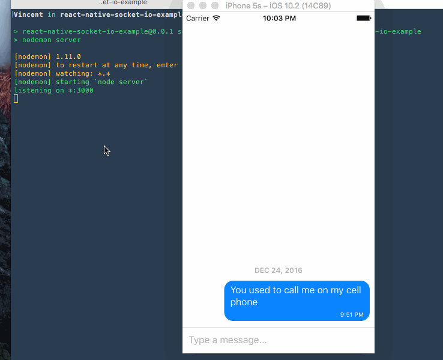

# React Native Socket.io Example
A demo for implementing a mobile chatroom as well as practice for myself using React Native and Socket.io. I talked more about this in my [Medium article](https://medium.com/@vinnyoodles/a-simple-messaging-app-with-react-native-and-socket-io-e1cae3df7bda)

### Getting started
First, install React Native, Socket.io and other node modules.
```bash
$ npm install
```

To start the server:
```bash
$ npm run server
```

In a separate terminal tab, start the client app.
```bash
$ npm run ios
```

To mock a conversation, I allowed the server to participate. The process that is running the server is listening for stdin. In other words, you can type in the server and it will appear in the chatroom.
```bash
$ npm run server
> [nodemon] 1.11.0
> [nodemon] to restart at any time, enter `rs`
> [nodemon] watching: *.*
> [nodemon] starting `node server`
> listening on *:3000
> Hello, this is the server speaking. How may I assist?
```

### Demo

